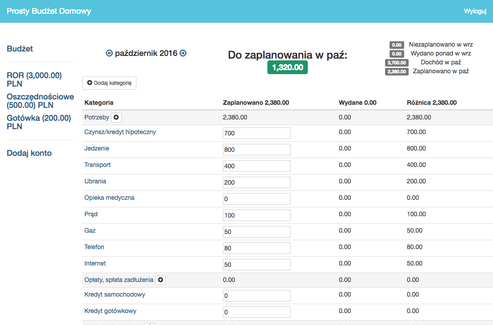

When it comes to personal finance for long time I was using YNAB. The budgeting app based on zero based budget. I was YNAB user when it was a desktop app. I liked the fact that it was one-time purchase. But in 2015 the YNAB was rewritten in a SAAS application and switched to subscription model and currently it costs $99 annually. Me personally I think it is too much for such an app and I am not feeling comfortable with putting my financial data to online YNAB. 
## Plain text accounting 
For some time I was using still YNAB as desktop app, but with some MacOS update the app does not longer run. So I was looking for other software. After YNAB I discovered [plain text accounting](https://plaintextaccounting.org/). 

> **Plain text accounting** is a way of doing bookkeeping and accounting with plain text files and scriptable, command-line-friendly software, such as [Ledger](https://ledger-cli.org/), [hledger](https://hledger.org), or [Beancount](https://beancount.github.io). (Quote from plaintextaccount.org)

At first I was using hledger, then I switched to Beancount. But although they are great tools, I found that they are really good at looking into the past, but it is not that easy to budget the available money. 
## Actual Budget
While searching for envelope based extension to plain text accounting apps, I discovered [Actual Budget](https://actualbudget.org) . I was really grateful to the creator [James Long](https://twitter.com/jlongster) of the software and the contributors. In the past I even tried to recreate YNAB on my own, so I can appreciate how good Actual is.





Actual is open source, the data lives where you want - locally, on NAS, on homelab cluster, in the cloud, you name it. But the most important fact is that I have control about it.
## Installing 

### Running on local
The install is as easy as running, you don’t need anything more than Docker. 

```yaml
docker run  -p 5006:5006 -v ./actual-data:/data actualbudget/actual-server:23.9.0
```

Of course you can also run it as npm app. 
### Running on Kubernetes cluster
When it comes to deploying on k8s, it is not difficult. What is needed is 
- PVC
- Deployment
- Service 
- Ingress

In my homelab I am using Traefik proxy with IngressRoute CRD, but any other will work. 

Please be aware that although there is password needed for login to access Actual Budget, it is not required to authenticate to access example.com/data/default-db.sqlite. As you can see I am using a traefik-forward-auth [middleware](https://doc.traefik.io/traefik/middlewares/http/forwardauth/). It uses this [service](https://github.com/thomseddon/traefik-forward-auth) to provide Google/OpenID oauth based login and authentication. This way your data will be secure and not accessible.

```yaml
---
apiVersion: v1
kind: PersistentVolumeClaim
metadata:
  name: actualbudget-pvc
spec:
  accessModes:
    - ReadWriteOnce
  resources:
    requests:
      storage: 1Gi
---
apiVersion: apps/v1
kind: Deployment
metadata:
  labels:
    app: actualbudget
  name: actualbudget
spec:
  selector:
    matchLabels:
      app: actualbudget
  template:
    metadata:
      labels:
        app: actualbudget
    spec:
      containers:
        - name: actualbudget
          image: actualbudget/actual-server:23.9.0
          ports:
            - containerPort: 5006
              name: http
              protocol: TCP
          volumeMounts:
            - mountPath: /data
              name: actualbudget-pv
      volumes:
        - name: actualbudget-pv
          persistentVolumeClaim:
            claimName: actualbudget-pvc
---
apiVersion: v1
kind: Service
metadata:
  name: actualbudget
spec:
  ports:
    - port: 5006
      protocol: TCP
      targetPort: http
  selector:
    app: actualbudget
---
apiVersion: traefik.containo.us/v1alpha1
kind: IngressRoute
metadata:
  name: actualbudget
spec:
  entryPoints:
    - websecure
  routes:
    - kind: Rule
      match: Host(`actualbudget.example.com`)
      services:
        - name: actualbudget
          port: 5006
          scheme: http
      middlewares:
        - name: traefik-forward-auth
          namespace: traefik
```
