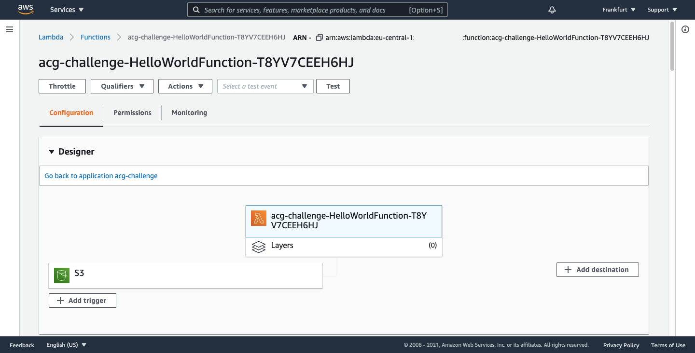

This week I was working on [#CloudGuruChallenge Multi Cloud Madness](https://acloudguru.com/blog/engineering/cloudguruchallenge-multi-cloud-madness). I decided to challenge myself. I know AWS, I know GCP and I did not know Azure. I have not designed or implemented a multi-cloud solution yet. So it seemed a perfect opportunity to try something new.

[GitHub repository](https://github.com/piotrbelina/cloudguruchallenge-multicloud/)

## Design

My solution uses 3 public cloud providers: AWS, Google Cloud and Azure. I described the infrastructure as a code using Terraform. 

 I will describe the flow below.
1. A user connects to a website hosted on AWS CloudFront. The website is stored on S3 bucket. It is simple HTML, CSS and JS. Direct hosting from S3 is not possible, but the JS uses WebRTC API to create pictures of a user which requires secure connection on HTTPS.
2. The user can see himself on the screen and take a picture of himself. The picture is uploaded to S3.
3. The S3 upload triggers Lambda function which does the main logic. It is written in Python. It was developed using AWS Serverless Application Model (AWS SAM). SAM greatly simplified the workflow. It was easy to add the required SDK of GCP and Azure. Also AWS Toolkit for PyCharm does a wonderful job: testing and debugging the application in IDE is a pleasure.
4. The Lambda function gets the bucket name and key from the S3 object created event.
5. It presigns the S3 URL so that the image is available to Google Cloud.
6. It calls Google Cloud Vision API to annotate the image.
7. It saves the result of the image recognition in Azure Cosmos DB.

You can check the [Lambda code here](https://github.com/piotrbelina/cloudguruchallenge-multicloud/blob/master/lambda/hello_world/app.py).

## What surprised me

* It took me some time to properly configure S3 presigning with boto3 library.
* Terraform is really a great tool for a multi-cloud project. For example I could easily create a GCP service account and save the credentials into AWS Systems Manager Parameter Store. Lambda function does not store any access key to other cloud providers.
* Lambda works quite fast. It takes 2-3 seconds to presign the URL, transfer it between AWS and GCP, annotated it and save the metadata into Azure Cosmos DB. 
* Although SAM local is a good tool, some shortcomings in my code I discovered after I deployed the code to the cloud and I started testing there.
* SAM deploy did not work out at the first time, I had to manually remove CloudFormation stack and rerun the deployment.

## Summary

I find it interesting to create a multi cloud solution from an engineering point of view. There are multiple things to consider while designing and implementing it. The providers offer similar services but each one has a slightly different approach. I would choose multi-cloud only as a last resort.

## Screenshots

### The website

### Lambda dashboard

### Google Cloud Vision API metrics

### Azure Cosmos DB item

