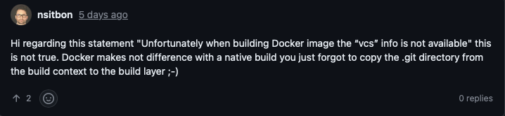

You may find useful to have Git commit hash and go version in your structured logs with every entry. To achieve it you can use following code. 

Working code example you can find on [GitHub](https://github.com/piotrbelina/code-for-blog/tree/main/git-version)

```go
package main  
  
import (  
    "log/slog"  
    "os" 
    "runtime"  
    "runtime/debug"
)  
  
var GitCommit = "NOCOMMIT"  
var GoVersion = runtime.Version()  
var BuildDate = ""  
  
func initVersion() {  
    info, ok := debug.ReadBuildInfo()  
    if !ok {  
       return  
    }  
    modified := false  
    for _, setting := range info.Settings {  
       switch setting.Key {  
       case "vcs.revision":  
          GitCommit = setting.Value  
       case "vcs.time":  
          BuildDate = setting.Value  
       case "vcs.modified":  
          modified = true  
       }  
    }  
    if modified {  
       GitCommit += "+CHANGES"  
    }  
}


func main() {  
    initVersion()  
  
    handler := slog.NewTextHandler(os.Stdout, nil)  
    logger := slog.New(handler)  
  
    logger = logger.With(slog.String("revision", GitCommit), slog.String("go_version", GoVersion), slog.String("build_date", BuildDate))  
  
    logger.Info("hello")  
}
```

Output
```
time=2024-09-26T18:36:01.242Z level=INFO msg=hello revision=9dd90bdafb4123062f45eb180c470ebe03621e2a+CHANGES go_version=go1.23.1 build_date=2024-04-26T14:14:27+0000
```

## Using `debug.ReadBuildInfo`

Go has `ReadBuildInfo` since version 1.12 but  from 1.18 you can find [BuildSetting](https://pkg.go.dev/runtime/debug#BuildSetting) with Git information.
```go
// ReadBuildInfo returns the build information embedded// in the running binary. The information is available only  
// in binaries built with module support.  
func ReadBuildInfo() (info *BuildInfo, ok bool) {

type BuildInfo struct {
	// GoVersion is the version of the Go toolchain that built the binary
	// (for example, "go1.19.2").
	GoVersion [string](https://pkg.go.dev/builtin#string)

	// Path is the package path of the main package for the binary
	// (for example, "golang.org/x/tools/cmd/stringer").
	Path [string](https://pkg.go.dev/builtin#string)

	// Main describes the module that contains the main package for the binary.
	Main [Module](https://pkg.go.dev/runtime/debug#Module)

	// Deps describes all the dependency modules, both direct and indirect,
	// that contributed packages to the build of this binary.
	Deps []*[Module](https://pkg.go.dev/runtime/debug#Module)

	// Settings describes the build settings used to build the binary.
	Settings [][BuildSetting](https://pkg.go.dev/runtime/debug#BuildSetting)
}

// A BuildSetting is a key-value pair describing one setting that influenced a build.//  
// Defined keys include:  
//  
//   - -buildmode: the buildmode flag used (typically "exe")  
//   - -compiler: the compiler toolchain flag used (typically "gc")  
//   - CGO_ENABLED: the effective CGO_ENABLED environment variable  
//   - CGO_CFLAGS: the effective CGO_CFLAGS environment variable  
//   - CGO_CPPFLAGS: the effective CGO_CPPFLAGS environment variable  
//   - CGO_CXXFLAGS:  the effective CGO_CXXFLAGS environment variable  
//   - CGO_LDFLAGS: the effective CGO_LDFLAGS environment variable  
//   - GOARCH: the architecture target  
//   - GOAMD64/GOARM/GO386/etc: the architecture feature level for GOARCH  
//   - GOOS: the operating system target  
//   - vcs: the version control system for the source tree where the build ran  
//   - vcs.revision: the revision identifier for the current commit or checkout  
//   - vcs.time: the modification time associated with vcs.revision, in RFC3339 format  
//   - vcs.modified: true or false indicating whether the source tree had local modifications  
type BuildSetting struct {  
  // Key and Value describe the build setting.  // Key must not contain an equals sign, space, tab, or newline.  // Value must not contain newlines ('\n').  Key, Value string  
}
```

## Docker

~~Unfortunately when building Docker image the "vcs" info is not available~~. 

**Edit 2.03.2025** [thanks to @nsitbon comment](https://github.com/piotrbelina/piotrbelina.com-hugo/discussions/4#discussioncomment-12318158) I realized I realized that having debug info is possible when building container. 



### copy .git directory to build-stage

To have debug info, you need to copy .git directory to build stage.

#### Dockerfile

```Dockerfile
FROM golang:1.23 AS build-stage

WORKDIR /app

COPY git-version-with-git-copy/go.mod ./git-version-with-git-copy/go.mod

WORKDIR /app/git-version-with-git-copy

RUN go mod download

WORKDIR /app

COPY . . # adds .git

WORKDIR /app/git-version-with-git-copy

RUN CGO_ENABLED=0 GOOS=linux go build -o /git-version

FROM alpine

WORKDIR /

COPY --from=build-stage /git-version /git-version

ENTRYPOINT ["/git-version"]
```

#### Container build

```bash
❯ docker build -f Dockerfile.gitversion -t git-version-with-git-copy . | pbcopy
[+] Building 0.7s (17/17) FINISHED                                                                                                  docker:orbstack
 => [internal] load build definition from Dockerfile.gitversion                                                                                0.0s
 => => transferring dockerfile: 453B                                                                                                           0.0s
 => [internal] load metadata for docker.io/library/alpine:latest                                                                               0.5s
 => [internal] load metadata for docker.io/library/golang:1.23                                                                                 0.5s
 => [internal] load .dockerignore                                                                                                              0.0s
 => => transferring context: 2B                                                                                                                0.0s
 => [build-stage 1/9] FROM docker.io/library/golang:1.23@sha256:adfbe17b774398cb090ad257afd692f2b7e0e7aaa8ef0110a48f0a775e3964f4               0.0s
 => [stage-1 1/3] FROM docker.io/library/alpine:latest@sha256:a8560b36e8b8210634f77d9f7f9efd7ffa463e380b75e2e74aff4511df3ef88c                 0.0s
 => [internal] load build context                                                                                                              0.0s
 => => transferring context: 19.71kB                                                                                                           0.0s
 => CACHED [build-stage 2/9] WORKDIR /app                                                                                                      0.0s
 => CACHED [build-stage 3/9] COPY git-version-with-git-copy/go.mod ./git-version-with-git-copy/go.mod                                          0.0s
 => CACHED [build-stage 4/9] WORKDIR /app/git-version-with-git-copy                                                                            0.0s
 => CACHED [build-stage 5/9] RUN go mod download                                                                                               0.0s
 => CACHED [build-stage 6/9] WORKDIR /app                                                                                                      0.0s
 => CACHED [build-stage 7/9] COPY . .                                                                                                          0.0s
 => CACHED [build-stage 8/9] WORKDIR /app/git-version-with-git-copy                                                                            0.0s
 => CACHED [build-stage 9/9] RUN CGO_ENABLED=0 GOOS=linux go build -o /git-version                                                             0.0s
 => CACHED [stage-1 2/3] COPY --from=build-stage /git-version /git-version                                                                     0.0s
 => exporting to image                                                                                                                         0.0s
 => => exporting layers                                                                                                                        0.0s
 => => writing image sha256:675553a0a3eb38ae56480492e85c95493465276794463519637f6ea734a35971                                                   0.0s
 => => naming to docker.io/library/git-version-with-git-copy                                                                                   0.0s
```

#### Run docker image
```bash
$ docker run git-version-with-git-copy
time=2025-03-02T21:50:09.952Z level=INFO msg=hello revision=7caf1856a38e668eb1da50e3df18e0118e7965aa+CHANGES go_version=go1.23.6 build_date=2025-03-02T16:03:37
```

### Using ldflags
In this case I find it is the easiest to pass build info as `ldflags`, which stands for `linker flags`. This way you can replace a string in the output binary.

```
# this is output when you build docker image without passing ldflags (without .git directory inside build stage)

2024-09-26T18:08:01.843630710Z time=2024-09-26T18:08:01.843Z level=INFO msg=hello revision=NOCOMMIT go_version=go1.23.1 build_date=""
```

#### Dockerfile

```Dockerfile
FROM golang:1.23 AS build-stage  
  
ARG COMMIT  
ARG BUILD_DATE  
  
WORKDIR /app  
  
COPY go.mod ./  
  
RUN go mod download  
  
COPY *.go ./  
  
RUN CGO_ENABLED=0 GOOS=linux go build -ldflags="-X main.GitCommit=$COMMIT -X main.BuildDate=$BUILD_DATE" -o /git-version  
  
  
FROM alpine  
  
WORKDIR /  
  
COPY --from=build-stage /git-version /git-version  
  
ENTRYPOINT ["/git-version"]
```

In this example you are adding two arguments:
1. COMMIT
2. BUILD_DATE

They are then passed as `ldflags` here

```bash
go build -ldflags="-X main.GitCommit=$COMMIT -X main.BuildDate=$BUILD_DATE" 
```

If you run `go tool link` you will see

```
  -X definition
        add string value definition of the form importpath.name=value
```

Sometimes it is not straightfoward to find this `importpath.name`.  You can run `$ go tool nm ./git-version | grep BuildDate` To see the full path

```
...
1001c00a0 B main.BuildDate
...
```

#### Makefile

```Makefile
.PHONY: docker  
  
GIT_COMMIT=$(shell git rev-parse HEAD)  
GIT_DIRTY=$(shell test -n "`git status --porcelain`" && echo "+CHANGES" || true) 
BUILD_DATE=$(shell TZ=UTC0 git show --quiet --date='format-local:%Y-%m-%dT%T%z' --format="%cd")  
  
docker:  
    docker build -f Dockerfile -t git-version --build-arg COMMIT=${GIT_COMMIT}${GIT_DIRTY} --build-arg BUILD_DATE=${BUILD_DATE} .
```

#### Build docker image

```bash 
$ make docker
docker build -f Dockerfile -t git-version --build-arg COMMIT=9dd90bdafb4123062f45eb180c470ebe03621e2a+CHANGES --build-arg BUILD_DATE=2024-04-26T14:14:27+0000 .
[+] Building 4.2s (14/14) FINISHED                                                                                                                                           docker:orbstack
 => [internal] load build definition from Dockerfile                                                                                                                                    0.0s
 => => transferring dockerfile: 389B                                                                                                                                                    0.0s
 => [internal] load metadata for docker.io/library/alpine:latest                                                                                                                        0.5s
 => [internal] load metadata for docker.io/library/golang:1.23                                                                                                                          0.5s
 => [internal] load .dockerignore                                                                                                                                                       0.0s
 => => transferring context: 2B                                                                                                                                                         0.0s
 => [build-stage 1/6] FROM docker.io/library/golang:1.23@sha256:2fe82a3f3e006b4f2a316c6a21f62b66e1330ae211d039bb8d1128e12ed57bf1                                                        0.0s
 => CACHED [stage-1 1/3] FROM docker.io/library/alpine:latest@sha256:beefdbd8a1da6d2915566fde36db9db0b524eb737fc57cd1367effd16dc0d06d                                                   0.0s
 => [internal] load build context                                                                                                                                                       0.0s
 => => transferring context: 54B                                                                                                                                                        0.0s
 => CACHED [build-stage 2/6] WORKDIR /app                                                                                                                                               0.0s
 => CACHED [build-stage 3/6] COPY go.mod ./                                                                                                                                             0.0s
 => [build-stage 4/6] RUN go mod download                                                                                                                                               0.1s
 => [build-stage 5/6] COPY *.go ./                                                                                                                                                      0.0s
 => [build-stage 6/6] RUN CGO_ENABLED=0 GOOS=linux go build -ldflags="-X main.GitCommit=9dd90bdafb4123062f45eb180c470ebe03621e2a+CHANGES -X main.BuildDate=2024-04-26T14:14:27+0000" -  2.9s
 => [stage-1 2/3] COPY --from=build-stage /git-version /git-version                                                                                                                     0.0s
 => exporting to image                                                                                                                                                                  0.0s
 => => exporting layers                                                                                                                                                                 0.0s
 => => writing image sha256:697239a7e86335315bfacef9a08fd0cd532391f3bc6657d920dce66223441233                                                                                            0.0s
 => => naming to docker.io/library/git-version                                                                                             
```

#### Run docker image

```bash
$ docker run git-version
time=2024-09-26T18:36:01.242Z level=INFO msg=hello revision=9dd90bdafb4123062f45eb180c470ebe03621e2a+CHANGES go_version=go1.23.1 build_date=2024-04-26T14:14:27+0000
```
