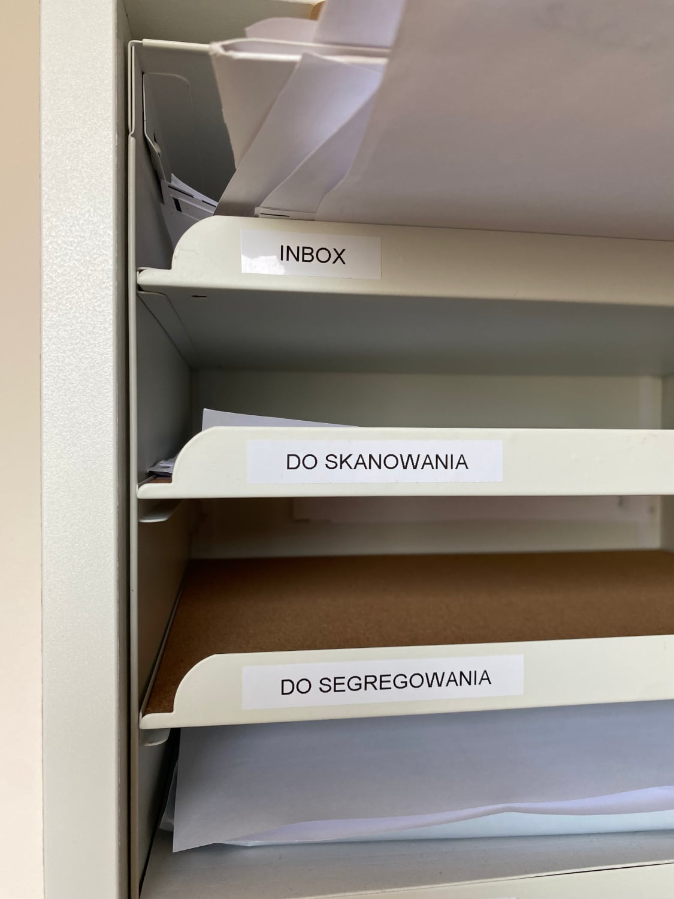
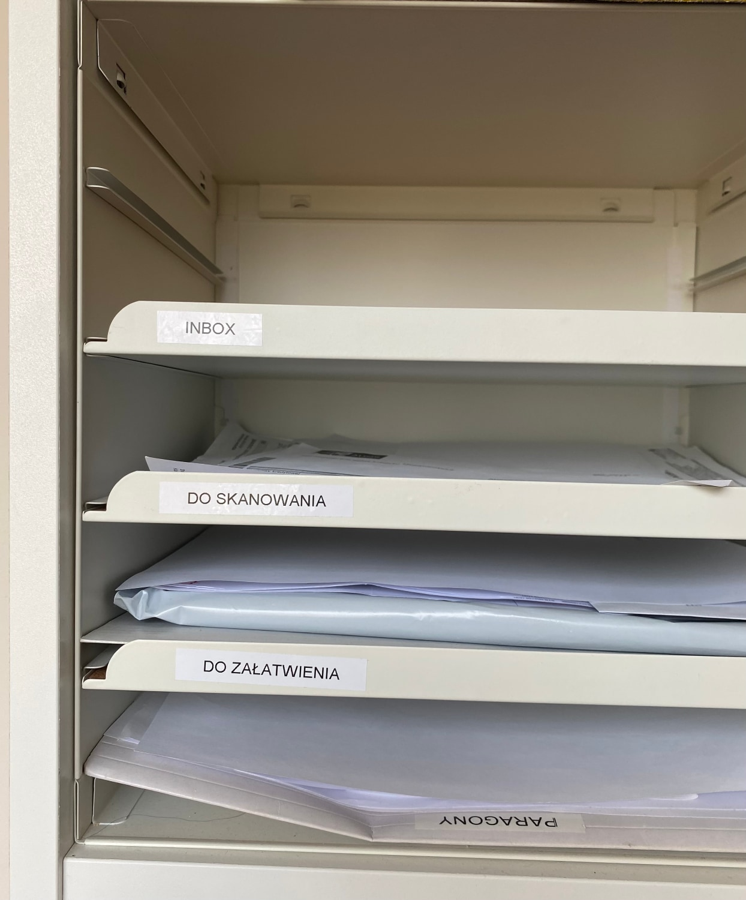

I was rereading David Allen’s Getting Things Done recently. I needed to restart my GTD system and it was a good opportunity to review the original system proposed by David Allen. When I was reading Chapter 6 about second step Clarifying, I found a fragment that applies to me.

> (…) In my early days of coaching I used to give my clients permission to keep a To File pile. No longer. **I discovered that if you can’t get it into your system immediately, you’re probably not ever going to**. If you won’t do it now, you likely won’t do it later, either.
>
> -- <cite>David Allen, Getting Things Done: The Art of Stress-Free Productivity.</cite>

When I was setting up my system for dealing with papers, I created 4 trays:
* Inbox,
* To Scan (Do Skanowania),
* To File (Do Segregowania),
* Outbox (Do Załatwienia).

So after the reading I decided to remove the To File drawer and have more space for Inbox. This way I can Capture more stuff, but when Clarifying it should be less friction. Putting it in other words, Getting „In” to Zero should be improved.

