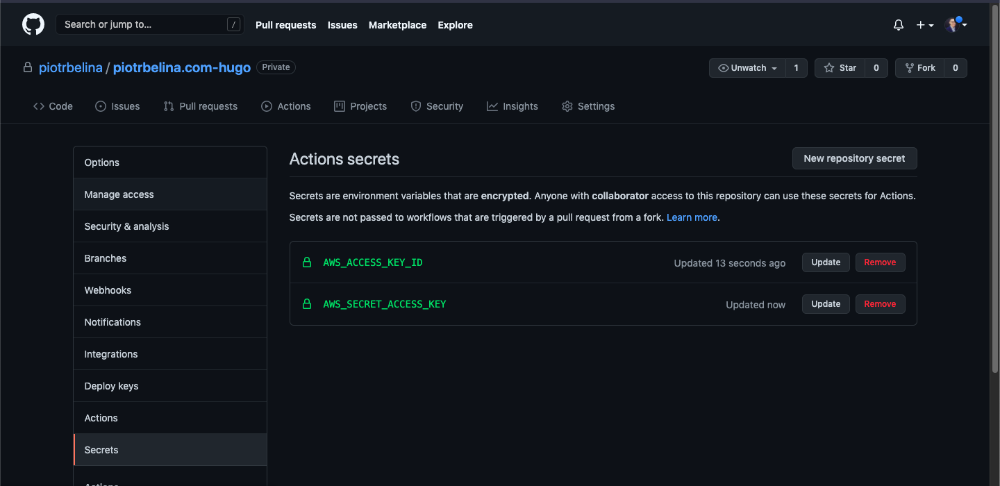
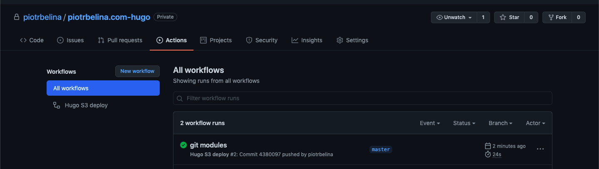
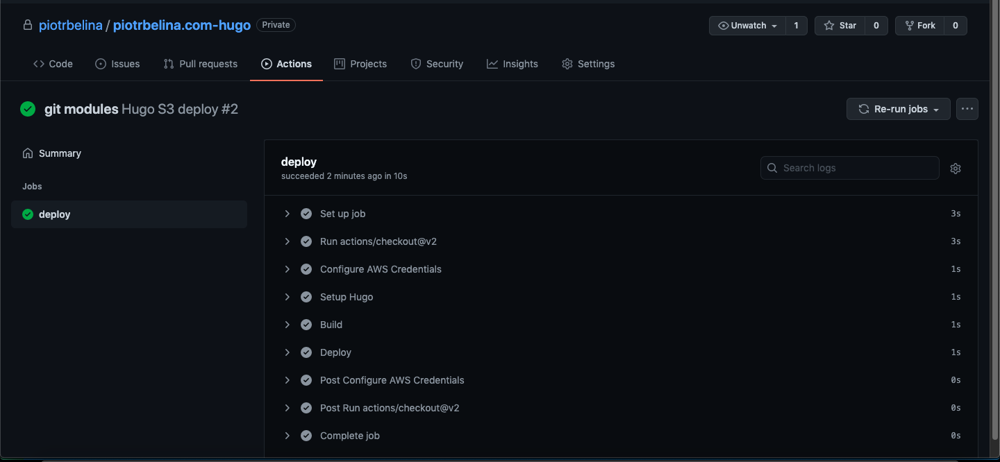

In this post I would like to describe how to create a simple Continuous Deployment pipeline for Hugo website with GitHub Actions.

## AWS GitHub account
First of all, we will need a AWS access key & secret key for GitHub Actions pipeline user to be able to deploy the website. I will create it with Terraform. The user `github_deploy` is created with `aws_iam_user` resource, you can of course changed the name of the user. I am also creating a policy `aws_iam_policy_document` to access S3 bucket with the website. I am assigning user with policy with `aws_iam_user_policy`. The access key is created with `aws_iam_access_key` . The key can be access by output value `aws_iam_deploy_secret`. 

```terraform
data "aws_iam_policy_document" "github_deploy" {
  statement {
    actions = [
      "s3:*"
    ]

    resources = [
      aws_s3_bucket.wwwpiotrbelinacom.arn,
      "${aws_s3_bucket.wwwpiotrbelinacom.arn}/*"
    ]
  }
  statement {
    actions = [
      "s3:GetBucketLocation"
    ]
    resources = [
      aws_s3_bucket.wwwpiotrbelinacom.arn
    ]
  }
}

resource "aws_iam_user" "github_deploy" {
  name = "github_deploy"
}

resource "aws_iam_user_policy" "github_deploy" {
  name   = "deploy_policy"
  user   = aws_iam_user.github_deploy.name
  policy = data.aws_iam_policy_document.github_deploy.json
}

resource "aws_iam_access_key" "github_deploy" {
  user = aws_iam_user.github_deploy.name
}

output "aws_iam_deploy_secret" {
  value     = aws_iam_access_key.github_deploy
  sensitive = true
}

```

To create our resources we run `terraform apply` and to see the keys we can check them with `terraform output aws_iam_deploy_secret`. 

```
❯ terraform apply
...
Outputs:

aws_iam_deploy_secret = <sensitive>
❯ terraform output aws_iam_deploy_secret
{
  "encrypted_secret" = tostring(null)
  "id" = "AKXXX"
  "key_fingerprint" = tostring(null)
  "pgp_key" = tostring(null)
  "secret" = "XXX"
  "ses_smtp_password_v4" = "BAXXX"
  "status" = "Active"
  "user" = "github_deploy"
}
```

## Hugo S3 Deploy
[Hugo supports deploying to S3](https://gohugo.io/hosting-and-deployment/hugo-deploy/) out-of-the-box. To do it, just add following to `config.toml`. 
```toml
[deployment]
# By default, files are uploaded in an arbitrary order.
# Files that match the regular expressions in the "Order" list
# will be uploaded first, in the listed order.
order = [".jpg$", ".gif$"]

[[deployment.targets]]
# An arbitrary name for this target.
name = "prod"

# S3; see https://gocloud.dev/howto/blob/#s3
# For S3-compatible endpoints, see https://gocloud.dev/howto/blob/#s3-compatible
URL = "s3://www.piotrbelina.com?region=eu-central-1"

[[deployment.matchers]]
# Cache static assets for 1 year.
pattern = "^.+\\.(js|css|svg|ttf)$"
cacheControl = "max-age=31536000, no-transform, public"
gzip = true

[[deployment.matchers]]
pattern = "^.+\\.(png|jpg)$"
cacheControl = "max-age=31536000, no-transform, public"
gzip = false

[[deployment.matchers]]
# Set custom content type for /sitemap.xml
pattern = "^sitemap\\.xml$"
contentType = "application/xml"
gzip = true

[[deployment.matchers]]
pattern = "^.+\\.(html|xml|json)$"
gzip = true
```

## GitHub Actions
To setup the pipeline we need to do two things:
1. Add secrets to repository settings.
2. Add workflow file and commit to the repo.

### AWS secrets
1. Go to your repo in GitHub
2. Go to **Settings -> Secrets**
3. Click **New repository secret**
4. Add two secrets `AWS_ACCESS_KEY_ID` and `AWS_SECRET_ACCESS_KEY`
5. The values you should grab from `terraform output aws_iam_deploy_secret ` from fields `id` and `secret`. 



### Workflow file
Now we should create file `.github/workflows/main.yml`  describing the pipeline. 

```yaml
name: Hugo S3 deploy

on:
  push:
    branches:
      - master

jobs:
  deploy:
    runs-on: ubuntu-20.04
    concurrency:
      group: ${{ github.workflow }}-${{ github.ref }}
    steps:
      - uses: actions/checkout@v2
        with:
          submodules: true  # Fetch Hugo themes (true OR recursive)
          fetch-depth: 0    # Fetch all history for .GitInfo and .Lastmod

      - name: Configure AWS Credentials
        uses: aws-actions/configure-aws-credentials@v1
        with:
          aws-access-key-id: ${{ secrets.AWS_ACCESS_KEY_ID }}
          aws-secret-access-key: ${{ secrets.AWS_SECRET_ACCESS_KEY }}
          aws-region: eu-central-1

      - name: Setup Hugo
        uses: peaceiris/actions-hugo@v2
        with:
          hugo-version: '0.87.0'
          # extended: true

      - name: Build HTML public/
        run: hugo --minify

      - name: Deploy to S3 bucket
        run: hugo deploy
```

## Summary
After you commit this file to the repository, the pipeline should start automatically. You can see it by clicking **Actions** tab in GitHub repository. 

Also what I noticed, the Hugo deployment is way faster comparing to Gatsby (10 s vs 2 minutes). 



