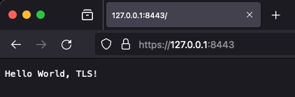

# 

When working on local environment, it is useful to use trusted TLS certificates. For this purpose we can use [mkcert](https://github.com/FiloSottile/mkcert). 

> mkcert automatically creates and installs a local CA in the system root store, and generates locally-trusted certificates.

## Instalation

First we need to install it

```
❯ mkcert -install
The local CA is already installed in the system trust store! 👍
The local CA is already installed in the Firefox trust store! 👍
```

## Generating the certificate

Then we can generate the cert for all domains that we would like to use.

```
❯ mkcert example.com "*.example.com" example.test localhost 127.0.0.1 ::1

Created a new certificate valid for the following names 📜
 - "example.com"
 - "*.example.com"
 - "example.test"
 - "localhost"
 - "127.0.0.1"
 - "::1"

Reminder: X.509 wildcards only go one level deep, so this won't match a.b.example.com ℹ️

The certificate is at "./example.com+5.pem" and the key at "./example.com+5-key.pem" ✅

It will expire on 5 July 2026 🗓
```

## Creating TLS server

Now we can use it in our `http.ListenAndServeTLS`

```go
func main() {
	mux := http.NewServeMux()
	mux.HandleFunc("/", func(w http.ResponseWriter, req *http.Request) {
		_, err := io.WriteString(w, "Hello World, TLS!\n")
		if err != nil {
			log.Fatal(err)
		}
	})
	log.Println("Starting listening on port 8443, open https://127.0.0.1:8443")
	log.Fatal(http.ListenAndServeTLS(":8443", "example.com+5.pem", "example.com+5-key.pem", mux))
}
```

## Testing

First let’s start Go server.

```
❯ go run main.go
2024/04/05 23:49:04 Starting listening on port 8443, open https://127.0.0.1:8443
```

When we curl, we can see that the cert is accepted.

```
 ❯ curl -v https://127.0.0.1:8443
...
* Server certificate:
*  subject: O=mkcert development certificate; OU=XXX
*  start date: Apr  5 21:24:54 2024 GMT
*  expire date: Jul  5 21:24:54 2026 GMT
*  subjectAltName: host "127.0.0.1" matched cert's IP address!
*  issuer: O=mkcert development CA; OU=XXX; CN=mkcert XXX
*  SSL certificate verify ok.
...
> GET / HTTP/2
> Host: 127.0.0.1:8443
> User-Agent: curl/8.4.0
> Accept: */*
>
< HTTP/2 200
< content-type: text/plain; charset=utf-8
< content-length: 18
< date: Fri, 05 Apr 2024 21:33:39 GMT
<
Hello World, TLS!
```

The same works in the browser. We don’t need to accept an untrusted cert.


